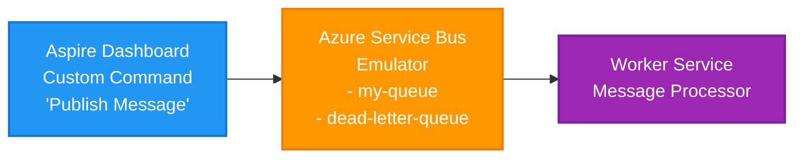

# PubSubDemo - Azure Service Bus with Aspire Interactive Commands

This sample demonstrates how to use Aspire's interaction service to build custom commands with interactive UI. It shows how to send messages to an Azure Service Bus emulator through a custom command in the Aspire dashboard.

## Components

- **AppHost**: Orchestrates the Azure Service Bus emulator and worker service
- **WorkerService**: Processes messages from the Service Bus queue  
- **Interactive Command**: Send messages to Service Bus through the Aspire dashboard

## Architecture



## Getting Started

### Requirements
- **.NET 9 SDK** - https://dotnet.microsoft.com/en-us/download
- **Docker** - https://www.docker.com/get-started/
- **Aspire CLI** - https://learn.microsoft.com/en-us/dotnet/aspire/cli/install

### Install Aspire CLI

**Windows:**
```ps1
iex "& { $(irm https://aka.ms/aspire/get/install.ps1) }"
```

**Linux/Mac:**
```bash
curl -sSL https://aka.ms/aspire/get/install.sh | bash
```

## Key Features

The interactive command demonstrates:
- Dropdown selection for available queues
- Text input for message content
- Visual feedback with success/error states
- Integration with Aspire's `IInteractionService`

## Customization

Add more queues in `AppHost.cs`:
```csharp
serviceBus.AddServiceBusQueue("new-queue");
```

## Resources

- [Aspire Documentation](https://learn.microsoft.com/en-us/dotnet/aspire/)
- [Aspire Interaction Service](https://learn.microsoft.com/en-us/dotnet/aspire/extensibility/interaction-service)
- [Custom Resource Commands](https://learn.microsoft.com/en-us/dotnet/aspire/fundamentals/custom-resource-commands)
- [Azure Service Bus Documentation](https://learn.microsoft.com/en-us/azure/service-bus-messaging/)
- [Worker Services in .NET](https://learn.microsoft.com/en-us/dotnet/core/extensions/workers)