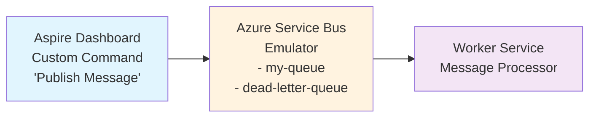

# PubSubDemo - Azure Service Bus with .NET Aspire Interactive Commands

This sample demonstrates how to use the new interaction service in .NET Aspire to build custom commands with custom UI. The example shows how to add a command that can send messages to an Azure Service Bus emulator with an interactive prompt.

## Overview

Using the new interaction service coming in the next version of .NET Aspire, it's now trivial to build custom commands that prompt with custom UI. This sample includes:

- **AppHost**: Orchestrates the Azure Service Bus emulator and worker service
- **WorkerService**: Processes messages from the Service Bus queue
- **Custom Interactive Command**: Allows sending messages to the Service Bus through the Aspire dashboard

## Architecture



## Features

### Interactive Command UI
The sample demonstrates the new Aspire interaction service by implementing a custom command that:
- Prompts the user with a dropdown to select a queue
- Provides a text input for the message content
- Sends the message to the selected Service Bus queue
- Provides visual feedback with success/error states

## Key Components

### Custom Command Implementation [`ServiceBusExtensions.cs`](PubSubDemo.AppHost/ServiceBusExtensions.cs)
The `WithCommands()` extension method adds an interactive "Publish Message" command that:
- Uses the `IInteractionService` to create a custom UI
- Provides dropdown selection for available queues
- Includes a text input for message content
- Handles the message sending logic with proper error handling

## Getting Started

## Usage

### Development Machine Requirements

- **.NET 8 SDK** - https://dotnet.microsoft.com/en-us/download
- **Docker Desktop** or Docker CLI - https://www.docker.com/get-started/
- **Aspire CLI (Nightly)**: Follow the installation guide at https://github.com/dotnet/aspire/blob/main/docs/using-latest-daily.md#install-the-daily-cli

### Install the Aspire CLI

```
dotnet tool install --global aspire.cli --prerelease --source https://pkgs.dev.azure.com/dnceng/public/_packaging/dotnet9/nuget/v3/index.json
```

## Key Learning Points

### Interaction Service Usage
This sample showcases the new Aspire interaction service (`IInteractionService`) which enables:
- **Custom UI Components**: Create dropdown menus, text inputs, and other form elements
- **Resource Integration**: Access resource properties and connection strings
- **Command Integration**: Add commands that appear in the Aspire dashboard
- **User Experience**: Provide intuitive ways to interact with your distributed application

### Service Bus Integration
- **Emulator Support**: Run Azure Service Bus locally for development
- **Queue Management**: Programmatically create and manage queues
- **Connection Handling**: Proper connection string management through Aspire
- **Message Processing**: Robust message handling with error management

## Customization

### Adding More Queues
To add additional queues, modify the `AppHost.cs`:
```csharp
serviceBus.AddServiceBusQueue("new-queue");
```

### Extending the Command
The interactive command can be extended to support:
- Message properties and metadata
- Different message types (JSON, XML, etc.)
- Batch message sending
- Message scheduling

### Custom Commands
Use this pattern to create other interactive commands for:
- Database operations
- API testing
- Configuration management
- Monitoring and diagnostics

## Notes

- The interaction service API is currently in preview and subject to change
- The sample uses reflection to access internal Aspire properties (see comments in `ServiceBusExtensions.cs`)
- The Service Bus emulator provides a local development environment without requiring Azure resources

## Resources

- [.NET Aspire Documentation](https://learn.microsoft.com/en-us/dotnet/aspire/)
- [Azure Service Bus Documentation](https://learn.microsoft.com/en-us/azure/service-bus-messaging/)
- [Worker Services in .NET](https://learn.microsoft.com/en-us/dotnet/core/extensions/workers)